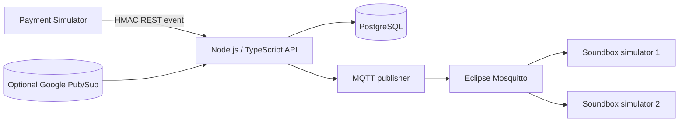
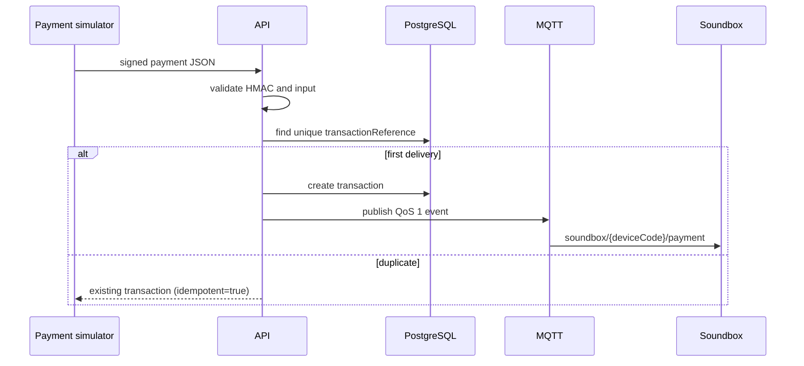

# Cloud-Native Payment Soundbox Platform

> Personal portfolio recreation using synthetic data.

**Personal portfolio recreation of a payment soundbox notification platform using synthetic data.** This project is an original educational/personal portfolio implementation using synthetic data and is not affiliated with or deployed by any bank or payment company. It contains no company source code, real merchants, customers, credentials, or internal infrastructure details.

## What it demonstrates

This is the parent project of [PayOps GenAI](https://github.com/sakti69-cssoft/PayOps). PayOps separately implements durable outbox dispatch, signed device receipts, monitoring and read-only incident investigation. Those child-project capabilities are not implicitly present in this repository.

The platform accepts a signed synthetic payment event, validates and stores it in PostgreSQL, publishes an announcement over MQTT, and lets one or more simulated soundboxes print it. It includes idempotency, management APIs, transaction history and replay, a local event-consumer abstraction, an optional Google adapter scaffold, structured logs, metrics, tests, Docker, CI, dependency updates, and strict Trivy gates.



## Local setup

Requires Node.js 24, Docker, and Docker Compose.

```bash
cp .env.example .env
npm install
npm run lint
npm test
npm run build
docker compose up -d --build --wait
docker compose ps
docker compose exec soundbox-api node dist/src/config/seed.js
```

Open `/health`, `/ready`, `/metrics`, and `/api-docs` on `http://localhost:3000`. Management endpoints require a JWT signed with `JWT_SECRET`. Payment bodies require `X-Soundbox-Signature`, a lower-case hex HMAC-SHA256 over recursively key-sorted canonical JSON using `PAYMENT_HMAC_SECRET`. The API, CLI, tests, and Postman use the same deterministic representation, so JSON whitespace and property order do not change the signature.

Reliable PowerShell signing:

```powershell
$body = '{"merchantCode":"SHOP-DEMO-001","transactionReference":"TXN-DEMO-500002","amount":500,"currency":"INR","status":"SUCCESS"}'
$signature = npm run --silent sign -- $body
Invoke-RestMethod -Method Post -Uri http://localhost:3000/api/v1/payments/notify -ContentType application/json -Headers @{ 'X-Soundbox-Signature' = $signature } -Body $body
```

## Verified synthetic flow

A synthetic ₹500 payment was validated through API → PostgreSQL → MQTT → simulated Soundbox announcement. Duplicate delivery of the same transaction reference returns the existing row without a second normal announcement; explicit authenticated replay intentionally publishes another announcement and records a device event.



## APIs

- `GET /health`, `GET /ready`, `GET /metrics`, `GET /api-docs`
- `POST/GET /api/v1/merchants`, `GET /api/v1/merchants/:id`
- `POST /api/v1/devices/register`, `GET /api/v1/devices/:id`
- `PATCH /api/v1/devices/:id/language|status`
- `POST /api/v1/payments/notify`
- `GET /api/v1/transactions`, `GET /api/v1/transactions/:id`
- `POST /api/v1/transactions/:id/replay`

## Security and reliability

Helmet, allow-listed CORS, 64 KB request limits, rate limits, JWT management authentication, webhook HMAC verification, Zod validation, correlation IDs, redacted Pino logs, non-root containers, unique database constraints, and structured production-safe errors are included. AES-256-GCM helpers demonstrate authenticated encryption for a small secret-backed configuration value; the 32-byte key is supplied as base64 in the environment. It is intentionally not applied to ordinary searchable domain data. Local anonymous MQTT is loopback/container-only and must be replaced with TLS, accounts, and ACLs in production.

## Operations and tests

`npm test` includes payment retry and production-configuration regression tests. Real PostgreSQL tests run when `TEST_DATABASE_URL` points to a database whose name starts with `soundbox_test`. They create and retain a unique schema for each run. Without that setting, those tests are explicitly skipped. GitHub CI supplies a PostgreSQL service and runs them automatically. Never use an application database for this setting.

For production, replace every placeholder in `.env.production.example` before startup. Production configuration rejects missing or example signing secrets, an invalid or zero encryption key and an example database URL. Do not commit generated credentials.

Run `k6 run -e PAYMENT_HMAC_SECRET=... load-tests/payment-notification.js` only after seeding. CI runs lint, unit/integration-style HTTP tests, and compilation on Node 24. The security workflow scans the repository and built image at HIGH/CRITICAL with `--ignore-unfixed` semantics and a failing gate. No performance or compliance claims are made.

## Limitations and roadmap

This portfolio version has one active device selection policy, no delivery acknowledgement protocol, no outbox, no broker ACLs, and only text output. Production evolution would add transactional outbox publishing, device certificates, MQTT ACLs/TLS, delivery acknowledgements and retries, multi-region partitioning, a fully configured Pub/Sub consumer and Secret Manager, TTS/audio caching, and alerting dashboards.

See [architecture](docs/architecture.md), [payment flow](docs/payment-flow.md), [security](docs/security.md), [database](docs/database.md), [MQTT](docs/mqtt.md), [API](docs/api.md), [deployment](docs/deployment.md), [troubleshooting](docs/troubleshooting.md), and the [interview guide](docs/interview-guide.md).
